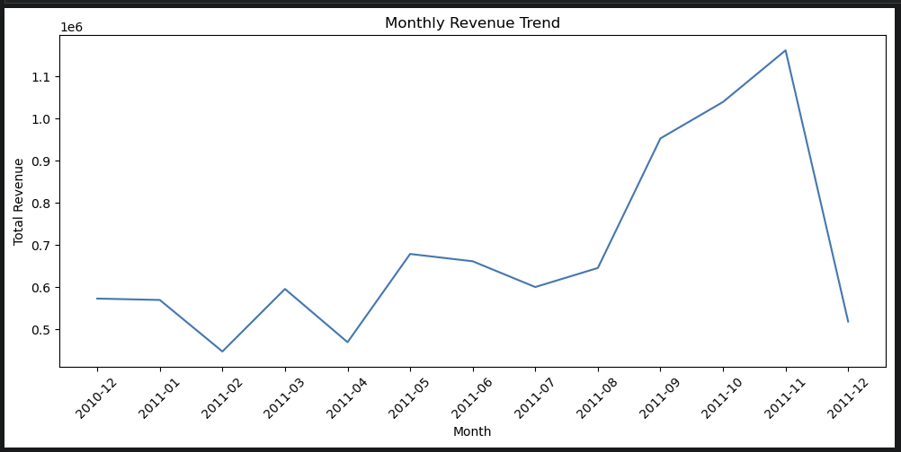
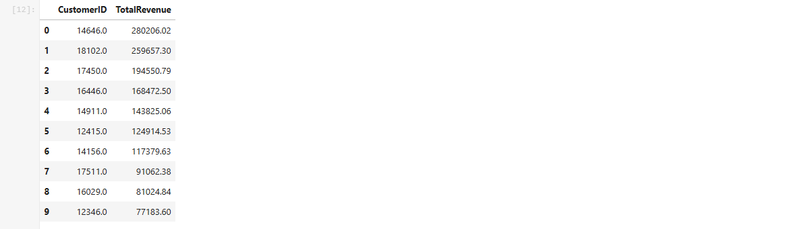

# SQL + Python Customer Analytics (Chinook Dataset)

This project combines SQL and Python to perform advanced customer analytics on the Chinook database. The focus is on revenue analysis, customer value measurement, and RFM-based customer segmentation.

---

## Tools Used
- SQLite (DB Browser for SQLite)
- SQL
- Python (pandas, numpy, matplotlib)
- Jupyter Notebook

---

## Key Analyses

### 1. Customer Revenue Analysis (SQL)
- Calculated total revenue and order frequency per customer
- Identified top customers by total revenue
- Analyzed customer purchase behavior across countries

---

### 2. Revenue Trend Analysis (Python)
- Converted invoice dates to proper datetime format
- Aggregated revenue on a monthly basis
- Visualized monthly revenue trends to identify seasonality and growth patterns

---

### 3. Top Customers by Revenue
- Ranked customers based on total revenue contribution
- Highlighted high-value customers driving a large share of overall revenue

---

### 4. RFM Customer Segmentation
- Built Recency, Frequency, and Monetary (RFM) metrics per customer
- Applied quartile-based scoring for each RFM component
- Identified high-value customers with an RFM score of **444**

**RFM = 444 indicates customers who:**
- Purchased very recently
- Purchase frequently
- Spend the most overall

---

## Key Insights
- A small group of customers contributes a disproportionately large share of total revenue
- High-frequency customers tend to generate higher lifetime value
- Revenue exhibits clear monthly trends and seasonality
- RFM segmentation effectively identifies customers suitable for loyalty and retention strategies

---

## Skills Demonstrated
- Advanced SQL querying and aggregation
- Data cleaning and transformation with Python
- Time-series revenue analysis
- RFM-based customer segmentation
- Translating analytical results into business insights

---

## Project Status
Completed
